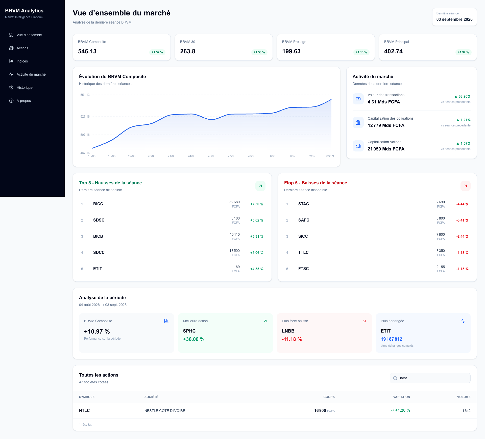

# BRVM Analytics

**Automated Market Data & Analytics Platform for the West African stock market (BRVM)**

BRVM Analytics is a personal data and analytics project designed to automatically collect, validate, store and analyze public market data from the **Bourse Régionale des Valeurs Mobilières (BRVM)**.

The project demonstrates an end-to-end data workflow combining **Python, PostgreSQL/Supabase, automation and a Next.js analytics dashboard**.

🌐 **Live Dashboard:** https://dashboard-brice-goye.vercel.app/

---

## 📊 Dashboard Preview



The dashboard provides an overview of BRVM market activity, including market indices, historical trends, trading activity, top gainers and losers, period performance and listed companies.

👉 **[Open the live dashboard](https://dashboard-brice-goye.vercel.app/)**

---


## 🎯 Project Goal

Public BRVM market data is available online, but building historical and analytical use cases requires reliable daily collection, structured storage and data-quality controls.

BRVM Analytics provides a pipeline capable of:

- collecting daily stock market data automatically;
- tracking listed companies and market indices;
- validating collected market sessions;
- preventing stale or duplicate observations;
- storing historical data in PostgreSQL/Supabase;
- exposing the data through an interactive dashboard;
- progressively building advanced analytics, scoring and predictive capabilities.

---

## 🏗️ Architecture

```text
BRVM Public Market Data
          │
          ▼
    Python Collector
          │
          ▼
 Parsing & Validation
          │
          ▼
   Data Quality Layer
          │
          ▼
 PostgreSQL / Supabase
          │
          ▼
   Next.js Dashboard
          │
          ▼
 Analytics / Scoring / AI
        (Roadmap)
```

The data collection process is automated using **GitHub Actions**.

---

## ✅ Available Now

### Automated Data Collection

Python-based collector retrieving daily BRVM market information.

Current coverage:

- **47 listed companies**
- BRVM Composite
- BRVM 30
- BRVM Prestige
- BRVM Principal

### Historical Storage

Collected observations are persisted in **PostgreSQL/Supabase**, creating a growing historical market dataset.

Main data domains include:

- companies;
- daily prices;
- market indices;
- import runs;
- sectors.

### Data Quality

The pipeline includes controls designed to improve the reliability of collected data.

Examples:

- market-session validation;
- stale-session rejection;
- duplicate-session prevention;
- import-run tracking;
- collection status monitoring.

### Automation

Daily collection is orchestrated through **GitHub Actions**, reducing manual intervention and continuously enriching the historical dataset.

### Analytics Dashboard

A responsive **Next.js / TypeScript** application provides access to market information and historical data.

Current dashboard sections include:

- Market overview
- Indices
- Market activity
- Historical data
- Stocks
- Project information

👉 **Live application:** https://dashboard-brice-goye.vercel.app/

---

## 🛠️ Tech Stack

### Data & Backend

- Python
- PostgreSQL
- Supabase
- SQL
- Requests
- BeautifulSoup
- lxml

### Frontend

- Next.js
- TypeScript

### Automation & Deployment

- Git
- GitHub
- GitHub Actions
- Vercel

---

## 📁 Repository Structure

```text
BRVM/
├── .github/workflows/   # Automated collection workflows
├── collector/           # BRVM data collection
├── config/              # Application configuration
├── dashboard/           # Next.js analytics dashboard
├── database/            # Database access and persistence
├── models/              # Data models
├── services/            # Business and data services
├── sql/                 # SQL resources
├── utils/               # Shared utilities
├── main.py              # Collector entry point
└── requirements.txt     # Python dependencies
```

---

## 🗺️ Roadmap

BRVM Analytics is being developed progressively as the historical dataset grows.

### Phase 1 — Data Foundation
**Status: Implemented**

- Automated market collection
- PostgreSQL/Supabase storage
- Market indices
- Data-quality controls
- Next.js dashboard
- Production deployment

### Phase 2 — Company Intelligence
**Target: 2026**

- Company profiles
- Fundamental analysis
- Authentication
- Enhanced stock analytics

### Phase 3 — Historical Analytics
**Target: December 2026 – January 2027**

- Enriched historical views
- Trend analysis
- Comparative company analytics
- Historical performance indicators

### Phase 4 — Scoring & Predictive Analytics
**Target: February – March 2027**

- Stock scoring
- Advanced indicators
- Predictive experimentation
- AI-assisted market insights

### Project Completion Target

**April 30, 2027**

> Predictive and AI capabilities are part of the project roadmap and are not presented as production-ready features.

---

## 💡 What This Project Demonstrates

BRVM Analytics is also a portfolio project demonstrating practical experience across an end-to-end data workflow:

**Data Collection → Data Quality → Storage → Automation → Analytics → Visualization**

It combines my professional Digital/Data Analytics background with growing capabilities in **Python, data engineering, automation and AI-powered analytics**.

---

## 👤 Author

**Brice Goye**

Senior Digital & Data Analyst  
Digital Analytics • Data • Python • Automation • AI